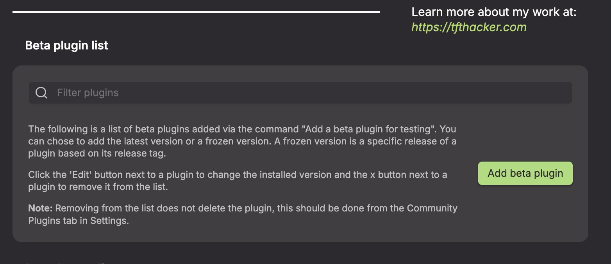
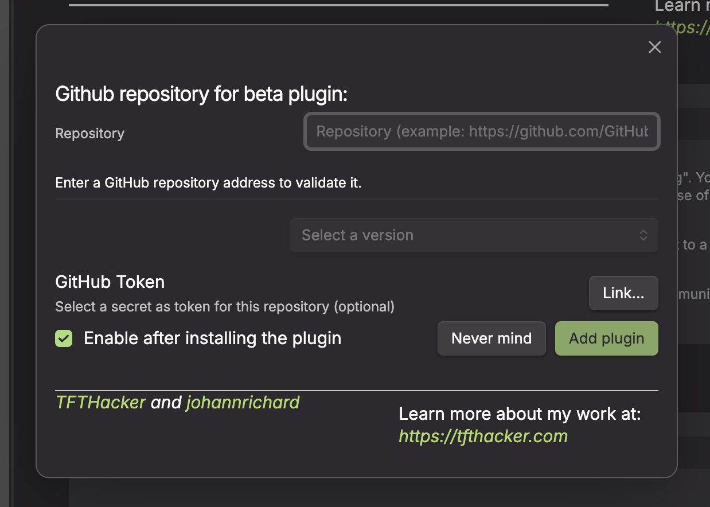
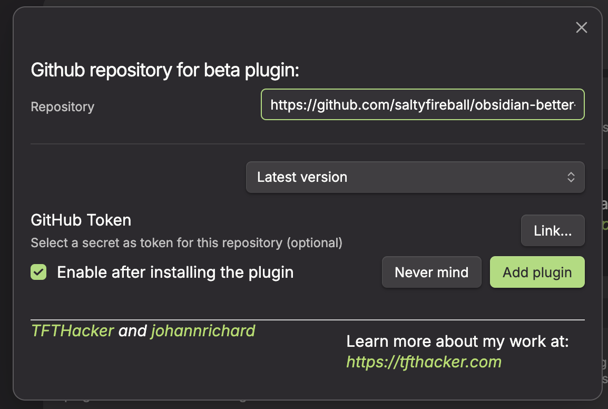

# Mermaid Version for Obsidian

        

  

An Obsidian plugin that enhances Mermaid diagram rendering with custom version loading, automatic sizing, and PNG export.

## Features

### Custom Mermaid Version

Load a newer version of Mermaid.js from CDN to access the latest diagram types and features that may not be available in Obsidian's bundled version.

- Quick presets for common versions (Latest 11.x, 11.12.3, 11.4.1)
- Custom CDN URL support (jsDelivr, unpkg, cdnjs)
- Live "Load & Re-render" button for testing without restart

### Auto-Sizing

Automatically adjusts Mermaid diagram dimensions based on their content width:

- **Wide diagrams** get horizontal scrolling while maintaining their natural size
- **Small diagrams** fit to the container without stretching
- Optional maximum width cap with preset buttons (600px, 800px, 1000px, 1200px)
- Optional centering for diagrams that fit within the container
- Automatically re-evaluates on window/pane resize
- Print-friendly: scales wide diagrams to fit page width
- Works in both reading and live preview modes

### PNG Export

Hover over any Mermaid diagram to reveal a download button for PNG export.

- 2x resolution for crisp output
- Theme-aware rendering (light/dark mode)
- Uses native share sheet on supported platforms, falls back to download

## Installation

### Obsidian Community Plugin (pending)

This plugin has been submitted for review to the Obsidian community plugin directory. Once approved, you will be able to install it directly from **Settings > Community plugins > Browse** by searching for "Mermaid Version".

### Using BRAT

You can install this plugin right now using the [BRAT](https://github.com/TfTHacker/obsidian42-brat) plugin:

1. Install BRAT from **Settings > Community plugins > Browse** (search for "BRAT" by TfTHacker)
2. Open the BRAT settings
3. Under the **Beta plugins** section, click **Add beta plugin**

   

4. In the overlay, enter this plugin's repository: `https://github.com/saltyfireball/obsidian-mermaid-version` (or just `saltyfireball/obsidian-mermaid-version`)

   

5. Leave the version set to latest

   

6. Click **Add plugin**

### Manual

1. Download the latest release from the [Releases](https://github.com/saltyfireball/obsidian-mermaid-version/releases) page
2. Copy `main.js`, `manifest.json`, and `styles.css` into your vault's `.obsidian/plugins/mermaid-version/` directory
3. Enable the plugin in **Settings > Community plugins**

## Settings

| Option                 | Description                              |
| ---------------------- | ---------------------------------------- |
| Enable plugin          | Master toggle (requires restart)         |
| Custom Mermaid version | Load a newer Mermaid.js from CDN         |
| Mermaid CDN URL        | URL to the mermaid.min.js file           |
| Auto-sizing            | Automatically fit or scroll diagrams     |
| Maximum width          | Cap the rendered width of wide diagrams  |
| Center diagrams        | Center smaller diagrams in the container |
| Export button          | Show PNG download button on hover        |

## License

MIT
